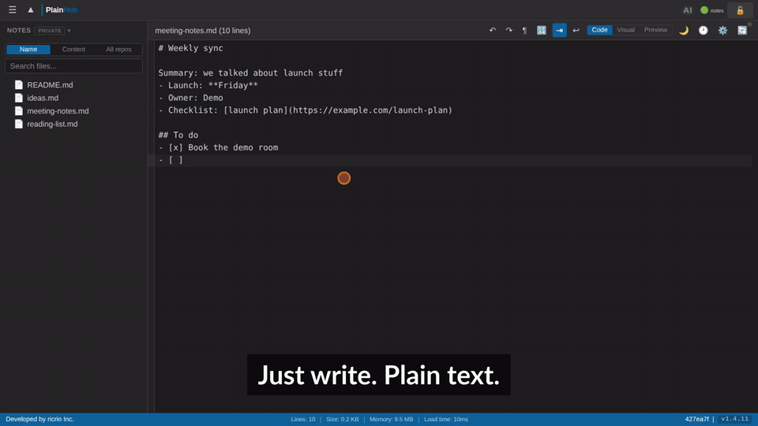
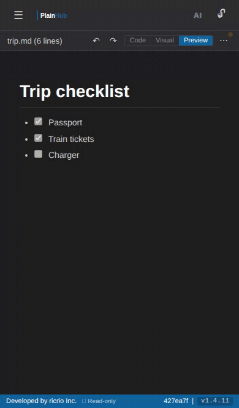

# PlainHub

**Your notes, in your own GitHub.** A plain-text editor for your GitHub repos, with Markdown support. Every save is a Git commit, and AI helps you edit.

[](https://app.plainhub.dev)
[](https://www.npmjs.com/package/plainhub)

[Website](https://plainhub.dev) · ▶ [30-second intro (YouTube)](https://youtu.be/2ThRzBnGxoE) · [Documentation](#documentation) · [日本語ドキュメント](docs/ja/README.md)



> **⭐ If PlainHub helps you, please star this repo — your support directly powers new features.**

PlainHub is an AI-driven online editor that makes GitHub simple for everyone.
No Git knowledge required. Open, edit, save — directly to your repo.
Handles huge files with ease. Control GitHub with natural language — just tell the AI what you want.
For engineers and non-engineers alike, working together in the same place.

## Why PlainHub

- **GitHub-native** — Your files are saved only in your own GitHub repository. PlainHub doesn't store them.
- **File contents never pass through PlainHub's servers** — Reading and saving go directly between your browser and the GitHub API. Sign-in uses a small server step — see the [privacy policy](https://plainhub.dev/privacy).
- **BYOK (Bring Your Own Key)** — Use your own AI API keys (e.g., Anthropic Claude). Keys stay in your browser, never sent to PlainHub servers.
- **AI for idea development** — Brainstorm, write, and edit alongside an AI assistant. Voice input and TTS read-aloud supported.
- **Frontend for GitHub** — Like github.dev, but for non-engineers. A notepad with version control built in.

## Features

### Edit from your phone

Open a note on your phone, fix a line, and it is saved — as a commit in your own repository.



### Editor

- **Markdown 3-mode editing** — Code / Visual (WYSIWYG) / Preview
- **Syntax highlighting** — Markdown, JSON, YAML, and more
- **Undo / Redo** — Full edit history
- **Line numbers, auto-indent, line wrapping** — Configurable
- **Whitespace visualization** — Toggle invisible characters
- **Keyboard shortcuts** — VS Code-style shortcuts (Ctrl+S, Ctrl+Z, etc.)

### File Management

- **Create / rename / duplicate / delete** files and folders
- **File history** — View past versions with diff
- **Sync & conflict resolution** — Real-time sync with GitHub
- **Image paste** — Paste images directly, auto-upload to repo
- **Cross-repo search** — Search across all your repositories

### Integration

- **CLI** — `plainhub open <file> -r <repo>` from your terminal
- **MCP Server** — Control from AI IDE (Claude Code, Cursor, VS Code)
- **Deep linking** — Share URLs with theme, font size, line number settings
- **PWA** — Install as native app on desktop and mobile

### Design

- **Dark / Light theme** — Automatic or manual
- **Mobile responsive** — Full-featured on phone and tablet

## Quick Start

### Web

Visit **[plainhub.dev](https://plainhub.dev)** and sign in with GitHub.

### CLI

```bash
npm install -g plainhub
plainhub auth --from-gh
plainhub open README.md -r owner/repo
```

### MCP Server (AI IDE)

```bash
npm install -g plainhub
claude mcp add plainhub -- plainhub-mcp
```

Then say: *"Open the README in owner/repo on PlainHub"*

## Documentation

- **[User Guide](docs/USER_GUIDE.md)** — Editor features and shortcuts
- **[Features](docs/FEATURES.md)** — Key features, data ownership, enterprise
- **[Use Cases](docs/USE_CASES.md)** — When and how to use PlainHub
- **[CLI Reference](docs/CLI.md)** — Terminal commands and options
- **[MCP Server](docs/MCP_SERVER.md)** — AI IDE integration
- **[FAQ](docs/FAQ.md)** — Troubleshooting and common questions
- **[日本語ドキュメント](docs/ja/)** — Japanese documentation

## Getting help

Stuck, found a bug, or have an idea? [Open an issue](https://github.com/ricrio-inc/plainhub/issues/new/choose) — no question is too small.

- **❓ How do I…?** — ask how to do something
- **🐞 Bug** — something doesn't work as expected
- **💡 Idea** — suggest an improvement

Replies may be drafted with the help of an AI assistant and are checked by the PlainHub team. Please don't post personal information, tokens, or private file contents — this repository is public.

## Links

- **App**: [app.plainhub.dev](https://app.plainhub.dev)
- **About**: [plainhub.dev](https://plainhub.dev)

## License

Copyright © 2025 [ricrio Inc.](https://ai.ricrio.jp/) All rights reserved.
